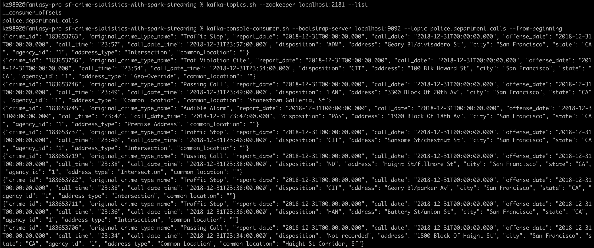

# SF Crime Statistics with Spark Streaming
 Udacity Data Streaming Nanodegree Project 2

### Develop Environment

* Java 1.8.x
* Scala 2.11.x
* Spark 2.4.3
* Kafka 2.3.0 build with Scala 2.11.x
* Python 3.7

### Step 0

* Use the command below to start the Zookeeper and Kafka servers

  ```bash
  $KAFKA_HOME/bin/kafka-server-start.sh config/server.properties
  $KAFKA_HOME/bin/zookeeper-server-start.sh config/zookeeper.properties
  ```

* Alternatively just run `./start_kafka.sh`  to start the Zookeeper and Kafka servers

### Step 1

* Use the command below to start the Kafka Producer which reads from data records from json file `police-department-calls-for-service.json` and publish 1 message per second to Kafka topic `police.department.calls`

* The Kafka topic can be examined with the following commands

  ```
  $KAFKA_HOME/bin/kafka-topics.sh --zookeeper localhost:2181 --list
  $KAFKA_HOME/bin/kafka-console-consumer.sh --bootstrap-server localhost:9092 --topic police.department.calls --from-beginning
  ```

  



