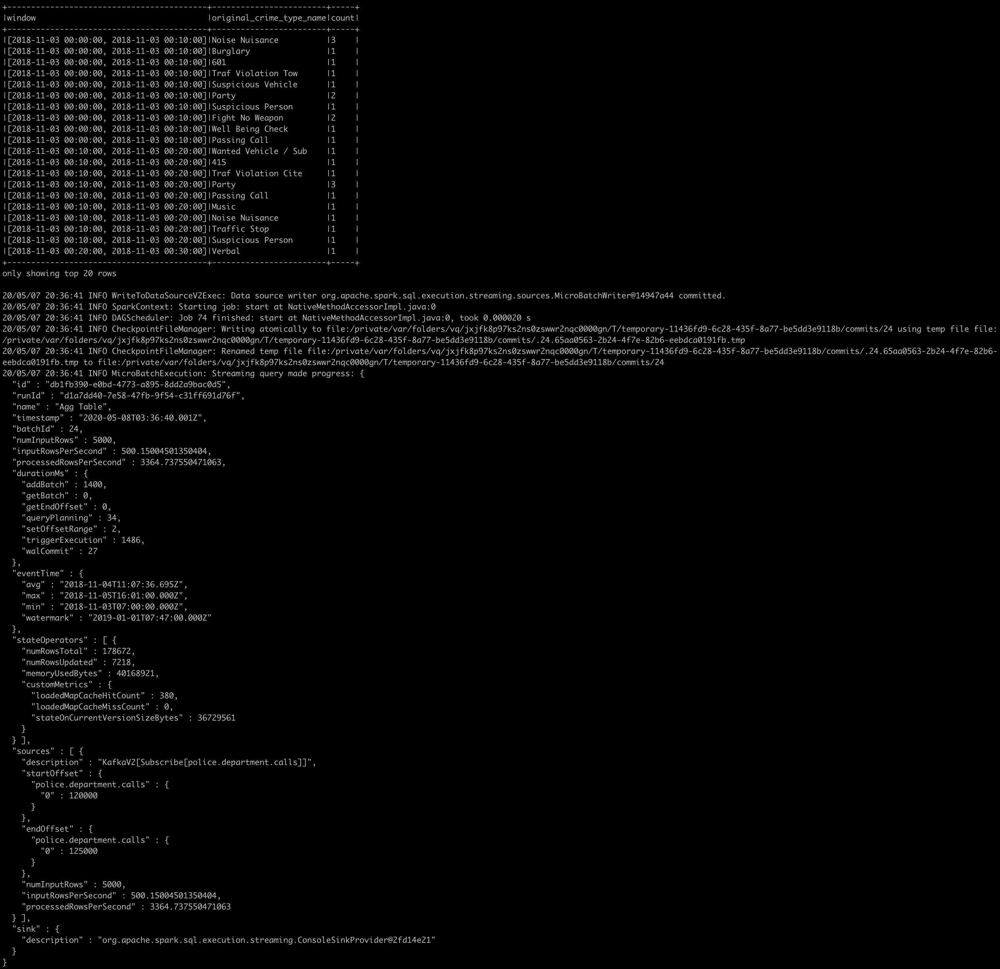

# SF Crime Statistics with Spark Streaming
 Udacity Data Streaming Nanodegree Project 2

### Develop Environment

* Java 1.8.x
* Scala 2.11.x
* Spark 2.4.3
* Kafka 2.3.0 build with Scala 2.11.x
* Python 3.7

### Step 0

* Use the command below to start the Zookeeper and Kafka servers

  ```bash
  $KAFKA_HOME/bin/kafka-server-start.sh config/server.properties
  $KAFKA_HOME/bin/zookeeper-server-start.sh config/zookeeper.properties
  ```

* Alternatively just run `./start_kafka.sh`  to start the Zookeeper and Kafka servers

### Step 1

* Use the command below to start the Kafka Producer which reads from data records from json file `police-department-calls-for-service.json` and publish 1 message per second to Kafka topic `police.department.calls`

* The Kafka topic can be examined with the following commands

  ```
  $KAFKA_HOME/bin/kafka-topics.sh --zookeeper localhost:2181 --list
  $KAFKA_HOME/bin/kafka-console-consumer.sh --bootstrap-server localhost:9092 --topic police.department.calls --from-beginning
  ```


### Step 2

* Do a spark-submit using the command

  ```
  spark-submit --packages "org.apache.spark:spark-sql-kafka-0-10_2.11:2.4.3" data_stream.py
  ```

* Or simply run `./submit_job.sh data_stream.py`

* The screenshort of the progress report 



* The screenshot of Spark UI `localhost:4040` (since we only use Structrued Streaming in this project, the Streaming UI tab is not available under Spark UI )

  

* Two streaming queries have been implemented in `data_stream.py`
  * Query `Agg Table` groups the `orginal_crime_type_name` by time window (10-minutes window size and 10-minutes step) using the `call_date_time` as timestamp with watermark (10 minutes) enabled. Then count the number of crime type within each window.
  * Query `Join Disposition` joins the stream `distinct_table` and DataFrame `radio_code_df` on column `disposition` (to see the progress report of this query, comment out line `query.awaitTermination()`)

### Step 3

Q1: How did changing values on the SparkSession property parameters affect the throughput and latency of the data?

A1: I have tried several options such as 

* "startingOffsets": controls the start point when query starts where to read from the Kafka topic.

 *  "maxOffsetsPerTrigger": limits maximum number of offsets processed per trigger interval. In my test, this parameter does have significant impact on throughput and latency. For example, if the processing time trigger is fixed at 10 seconds, a larger "maxOffsetPerTrigger" could lead to more messages being processed which means higher throughput and lower latency. 

 *  "maxRatePerPartition": limits maximum number of messages read per partition per second (it supposes to also affect the throughput and latency. But in the test, it seems this option has no effect with Structured Streaming and only works with Spark Streaming)

 *  "spark.sql.shuffle.partitions": controls the number of shuffle partitions which is caused by group or join operation. Effective parallelizing could positively affect the throughput and latency.

   

Q2: What were the 2-3 most efficient SparkSession property key/value pairs? Through testing multiple variations on values, how can you tell these were the most optimal?

A2: In my test, "maxOffsetsPerTrigger" and "spark.sql.shuffle.partitions" are most efficient properties.

As mentioned in A1, we probably want to choose a large "maxOffsetsPerTrigger" to achieve higher throughput. But there are something else we should consider. For example, the trigger setting of the streaming query controls the timing of streaming data processing, in this project, I am using a fixed interval micro-batches trigger  (10s interval), if we want to get lower latency, we will have to reduce this interval or even use the continuous trigger. Assume the incoming message rate is very large and we pick up a very large "maxOffsetPerTrigger" as well, our computer/cluster probably will not complete the batch within the small interval. 

By default, the number of shuffle partitions is set to 200 and 200 tasks can be observed in the Spark UI, it is a overkill which slows the processing due to scheduling overhead since the data size used in this project is relatively small (this blog provides a good explanation on this issue http://blog.madhukaraphatak.com/dynamic-spark-shuffle-partitions/) Each job takes about 6 ~ 7s with the default number of shuffle partitions. After changing it to a small number such as 2, the time taken by each job reduces to merely 0.1 ~ 0.2s. 

